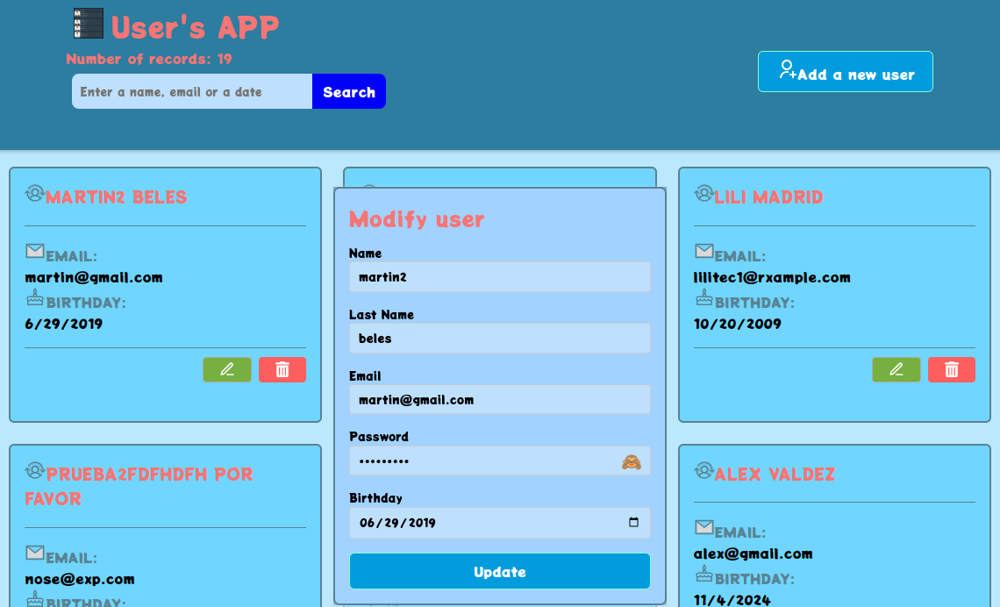

# Manage Users

## User CRUD!

This web application, built with ReactJS and Vite, allows you to register, edit, delete, search, and list users. Input fields are validated using react-hook-form and yup. It includes pagination for records. It utilizes icons from react-icons.github.io and modal windows for alert messages during operations.


Para la versión en español de este documento, haga clic [aquí](README_ES.md).

## Features

- **Complete Data:** Displays names, email addresses, passwords (with visibility option), and birth dates.

- **Intuitive Interface:** Modern responsive design that is easy to use, optimized for various devices.

- **Robust Validation:** Input fields are custom validated with react-hook-form and yup. Fields are validated in real-time to ensure data integrity. The following fields are validated:
    - Names: First name and last name, minimum 3 characters, letters only.
    - Email: Valid email format.
    - Birth Date: Valid date format (MM/DD/YYYY), does not allow future dates or dates prior to 1950.

- **Reusable Components:** Modular code structure for easier maintenance.

- **Hooks:** Utilizes useState, useEffect, useRef hooks, custom hook for connecting to the REST API and pagination.

- **CSS:** Styles the application.

- **ReactJS:** JavaScript framework for building user interfaces.

- **Vite:** Fast frontend build tool based on ES modules.

- **Icons from react-icons.github.io:** Custom icons to enhance the interface.

- **License:** MIT license allows use for any personal or commercial project as long as this README.md, my name, and the MIT license are maintained.

You can visit the online platform at [https://crud-users-fmg.vercel.app/](https://crud-users-fmg.vercel.app/)

## System Requirements

- **Operating System:** Ubuntu 22.04.4 LTS or Windows 10 Pro 1803 

- **NodeJS:** Version 18.20.4 or higher 

- **npm/npx:** Version 10.8.4 or higher 

- **Vite:** Version 5.4 or higher 

- **ReactJS:** Version 18.3 or higher 

## Alternative Systems Tested

The project has also been tested in the following alternative environment:

- **Operating System:** Windows 10 Pro 1803

- **NodeJS:** NodeJS: 18.20.4

- **npm/npx:** Version 10.8.4 or higher 

- **Vite:** Version 5.4 or higher 

- **ReactJS:** Version 18.3 or higher 

## Contributions

Contributions are welcome. If you find any bugs or want to add new features, feel free to open an issue, a pull request, or fork the repository.

## Images

Add Screen 

## Useful Commands

View system information:

```bash
uname -r
sb_release -a
node -v
npm -v
```


## Project Structure

The project structure is:
```
index.html
readme.md
└── src/
    ├── App.jsx
    ├── App.css
    ├── index.css
    ├── components/
    │   ├── AddEdit.jsx
    │   └── Modal.jsx
    │   └── UserList.jsx
    │   └── Search.jsx
    │   └── UserCard.jsx
    ├── hooks/
    │   ├── useFetch.jsx
    │   └── usePagination.jsx
    ├── layout/        
    │   └── Layout.jsx
    └──  assets/
        └── img/
           └── header-img.png

```
# Installation

To install, download the project from the repository:

```bash
git clone https://github.com/fabinnerself/s04e04-crudUsers-fmg.git
```

```bash
then run:

cd  s04e04-crudUsers-fmg

npm i axios react-hook-form yup
```


(C) Favian M.G. 2024 